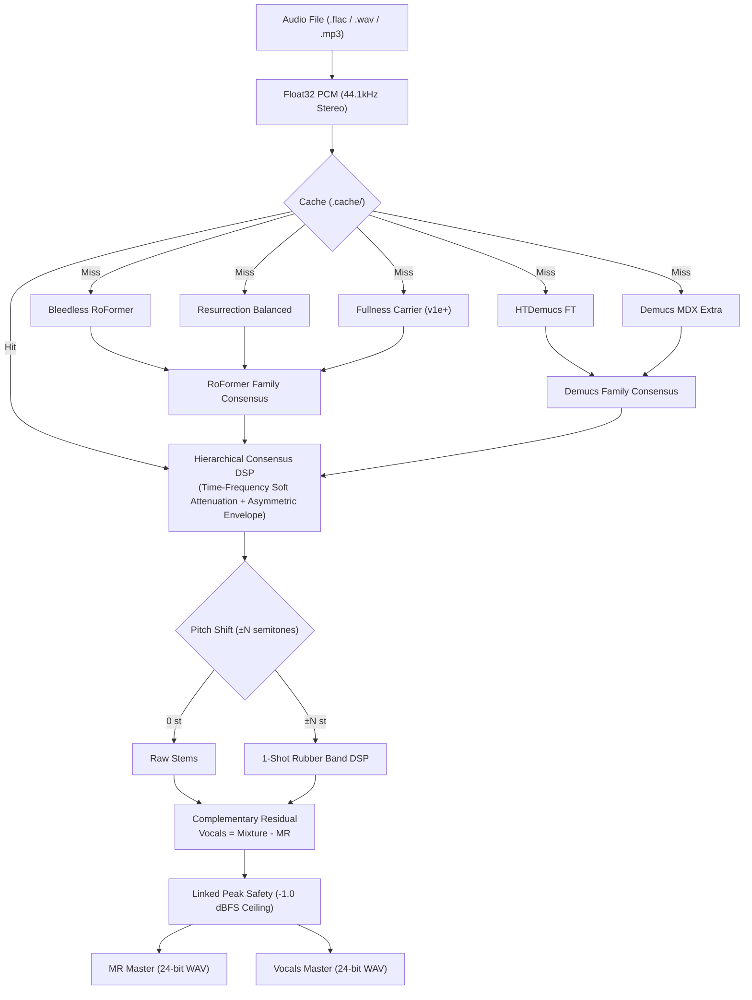

# inst-splitter

<div align="center">

[](https://opensource.org/licenses/MIT)
[](https://www.python.org/)
[](https://github.com/Mokee04/inst-splitter/actions/workflows/ci.yml)
[](https://github.com/Mokee04/inst-splitter/releases)

**5-Model Heterogeneous Ensemble AI Instrumental & Complementary Vocals Splitter**

[🇰🇷 한국어 설명서 (README_KO.md)](./README_KO.md) | [Report Bug](https://github.com/Mokee04/inst-splitter/issues) | [Request Feature](https://github.com/Mokee04/inst-splitter/issues)

</div>

---

## 🌟 Overview

`inst-splitter` is an automated, studio-grade AI audio separation and cover production engine. By orchestrating a **5-model heterogeneous ensemble** (3 RoFormer models + 2 Demucs models) through **Hierarchical Consensus DSP**, it extracts pristine **MR (Instrumentals)** and mathematically exact **Complementary Residual Vocals** without phase cancellation or loss of musical transients.



---

## ✨ Key Features

1. **5-Model Heterogeneous Ensemble (Hierarchical Consensus)**:
   - **RoFormer Family**: `Bleedless`, `Balanced`, `Fullness (Carrier)`
   - **Demucs Family**: `HTDemucs FT`, `Demucs MDX Extra`
   - Heavy attenuation occurs only when *both* model families agree on vocal presence. When architectures disagree, acoustic fullness and spatial reverb tails are preserved.
2. **Complementary Residual Vocals**:
   - $\text{Vocals} = \text{Mixture} - \text{MR}$ (and $\text{Vocals}' = P(\text{Mixture}) - P(\text{MR})$).
   - Invariant guarantee: $\text{MR} + \text{Vocals} = \text{Original}$ in 32-bit float precision.
3. **Linked Peak Safety**:
   - A single linked common gain reduction factor ($g$) is calculated from $\max(\text{Peak}_{MR}, \text{Peak}_{Vocals})$, keeping both stems under $-1.0\text{ dBFS}$ without squashing dynamic range or distorting relative levels.
4. **Asymmetric Envelope Smoothing DSP**:
   - Attack (40ms) for fast vocal cutoff + Release (100ms) for smooth recovery, eliminating chirping and watery artifacts.
5. **1-Shot Pitch Shifting (Rubber Band)**:
   - Full-mix pitch shifting preserves drum transients and avoids inter-stem phasing.
6. **24-bit Studio Master Output**:
   - High-fidelity 44.1kHz 2-channel 24-bit PCM (`PCM_24`) WAV export.

---

## 🚀 Quick Start

### 1. Prerequisites

Make sure system audio dependencies (`ffmpeg`, `rubberband`, `libsndfile`) are installed:

- **macOS** (Homebrew):
  ```bash
  brew install ffmpeg rubberband libsndfile
  ```
- **Ubuntu / Debian**:
  ```bash
  sudo apt-get update && sudo apt-get install -y ffmpeg rubberband-cli libsndfile1
  ```
- **Windows** (Scoop / Chocolatey):
  ```powershell
  scoop install ffmpeg rubberband
  ```

### 2. Installation

```bash
# Clone the repository
git clone https://github.com/Mokee04/inst-splitter.git
cd inst-splitter

# Install with pip (or uv)
pip install -e .
```

### 3. Usage

#### Single Track Separation:
```bash
# Keep original pitch (0 semitones)
inst-split "song.flac" 0

# Lower pitch by 5 semitones (-5st) for female-to-male key
inst-split "song.flac" -5

# Raise pitch by 2 semitones (+2st)
inst-split "song.mp3" +2
```

Outputs are automatically saved to `<song_folder>/MR_output/`:
- `{song}_MR_{-5st}.wav`
- `{song}_Vocals_{-5st}.wav`

#### Folder Batch Separation:
```bash
# Process all songs in a directory at -5st
inst-splitter-batch "/Music/MyAlbum" -5

# Recursively search subdirectories and save to custom folder
inst-splitter-batch "/Music/Library" 0 --recursive --output-dir "./results"
```

---

## 🛠️ CLI Reference

### `inst-split` (Single Track)
```text
usage: inst-split [-h] [--config CONFIG] [--force] [--debug] [--output-dir OUTPUT_DIR]
                  file_path semitone

positional arguments:
  file_path             Path to input audio (.flac, .wav, .mp3, .ogg, .m4a)
  semitone              Semitone pitch shift value (e.g. -5, +2, 0, -1.5)

options:
  --config CONFIG       Path to custom config.yaml
  --force               Force re-separation bypassing cache
  --debug               Enable debug logging
  --output-dir DIR      Custom output directory (default: <file_folder>/MR_output)
```

### `inst-splitter-batch` (Batch Processing)
```text
usage: inst-splitter-batch [-h] [--recursive] [--config CONFIG] [--force]
                           [--debug] [--output-dir OUTPUT_DIR]
                           folder_path semitone

options:
  -r, --recursive       Recursively search subfolders for audio files
  --output-dir DIR      Unified output directory for all stems
```

---

## 🐍 Python API

You can easily integrate `inst-splitter` into your own Python applications:

```python
from pathlib import Path
from inst_splitter import run_pipeline, load_audio_as_stereo_pcm

# Run full separation pipeline
result = run_pipeline(
    input_path="song.flac",
    semitone=-5.0,
    output_dir="./output"
)

print(f"Generated MR: {result.mr_path}")
print(f"Generated Vocals: {result.vocals_path}")
```

---

## ⚙️ Configuration (`config.yaml`)

You can customize ensemble models, frequency attenuation limits, and smoothing parameters in `config.yaml`:

```yaml
models:
  bleedless:
    name: "Bleedless RoFormer"
    model: "mel_band_roformer_instrumental_fv7z_gabox.ckpt"
    family: "roformer"
    weight: 1.0
  balanced:
    name: "Resurrection Balanced"
    model: "bs_roformer_instrumental_resurrection_unwa.ckpt"
    family: "roformer"
    weight: 1.0
  fullness:
    name: "Fullness Carrier (v1e+)"
    model: "melband_roformer_inst_v1e_plus.ckpt"
    family: "roformer"
    weight: 0.8
    carrier: true
  demucs_ft:
    name: "HTDemucs FT"
    model: "htdemucs_ft.yaml"
    family: "demucs"
    weight: 0.6
  demucs_extra:
    name: "Demucs MDX Extra"
    model: "htdemucs.yaml"
    family: "demucs"
    weight: 0.5

ensemble:
  removal_threshold: 0.45
  soft_temperature: 0.10
  low_quantile: 0.25
  attenuation:
    frequency_limits:
      sub:
        max_attenuation_db: 3.0   # Preserve sub-bass & kick body
      vocal:
        max_attenuation_db: 10.0  # Core vocal suppression
      air:
        max_attenuation_db: 4.0   # Preserve cymbals & high air

transpose:
  engine: "rubberband"
  rbargs:
    pitch_hq: true
    formant: false
```

---

## ⚡ Performance & Caching

- **Sequential Memory Management**: Models are loaded and unloaded sequentially, enabling high-performance execution even on systems with limited GPU VRAM (6GB+) or Apple Silicon Unified Memory.
- **Smart Hash Caching**: Model stems are cached under `.cache/<source_hash>/`. When changing key (e.g. trying `-3st`, `-4st`, `-5st` on the same track), AI inference is skipped and results are produced in seconds.

---

## 🤝 Contributing

Contributions are welcome! Please check out [CONTRIBUTING.md](./CONTRIBUTING.md) for setup and guidelines.

---

## 📄 License

Distributed under the MIT License. See [LICENSE](./LICENSE) for details.

---

## 🙏 Acknowledgements & Credits

- [audio-separator](https://github.com/nomadkaraoke/python-audio-separator)
- [Demucs](https://github.com/facebookresearch/demucs) by Facebook Research
- [Mel-Band RoFormer](https://github.com/lucidrains/music-spectrogram-diffusion-pytorch) / BS-RoFormer
- [Rubber Band Library](https://breakfastquay.com/rubberband/) by Breakfast Quay
